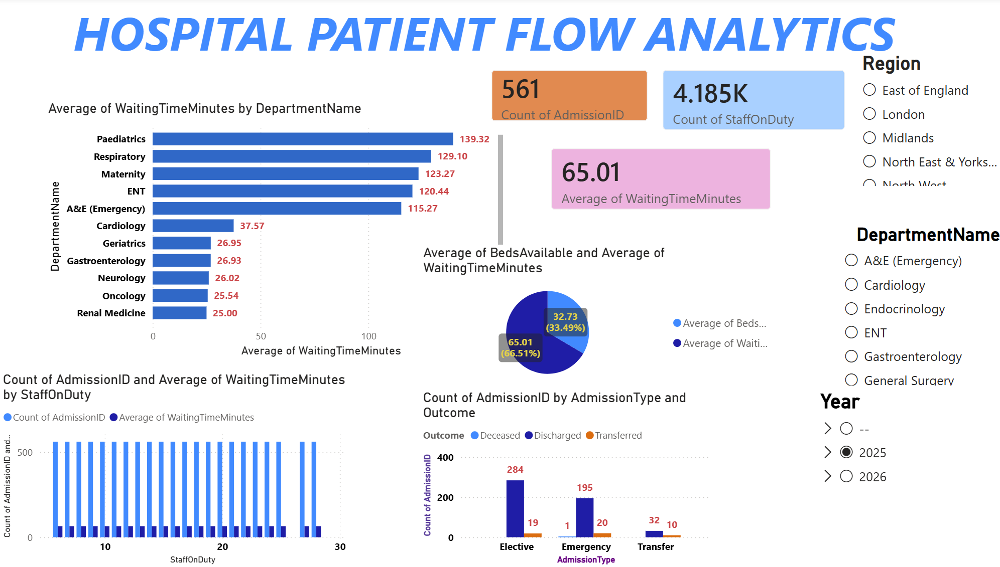

# 📊 Data Analytics Portfolio

Welcome to my Data Analytics portfolio. This repository contains projects completed during my Level 3 Certificate in Data Analytics and through independent practice.

These projects demonstrate my ability to collect, clean, transform, analyse and visualise data using SQL, Excel and Power BI to generate business insights and support decision-making.

## Skills Demonstrated

- SQL
- Microsoft Excel
- Power BI
- Data Cleaning
- Data Validation
- Data Transformation
- Dashboard Development
- KPI Reporting
- Business Intelligence
- Data Visualisation

---

## Projects

### 🛍️ Retail Sales Insights Dashboard

**Objective**

Analyse retail sales data across product categories(Technology, furnitures, and office supplies), customer segments( consumer, corporate, small business and home office) and regions to identify sales trends, profitability and business opportunities.

**Tools**

- SQL
- Excel
- Power BI

**Key Insights**

- Technology generated the highest sales and profit.
- Furniture generated higher sales than Office Supplies but lower profitability.
- Corporate customers represented the largest share of sales.
- Central was the highest-performing region.

  **Dashboard**
  

  

---

### 🏥 Hospital Patient Flow Analytics

**Objective**

Analyse hospital operations to understand patient flow, waiting times and bed utilisation.

**Tools**

- SQL
- Excel
- Power BI

**Key Insights**

- All deprtments experience waiting times above 20 min. Paediatrics has the highest average waiting time (114 min), followed by Maternity, Respiratory, ENT and A&E departments.
- The hospital admitted 817 patients: 746 patients discharged, 70 patients transferred and emergency recorded  deceased.
- Higher staffing level do not always lead to shorter waiting times.
- Some departments with more beds still experience long waiting times.
- Witing times might be influenced by other factors: Patient arrival volumes, emergency demand, depatment workload, patient complexity, etc...

 **Dashboard**
  

  

### 🏡 UK Housing Market Insights (2023 - 2024)

**Objective**

Analyse UK property market data to identify house prices by regions, growth rate, investment opportunities and regional trends.

**Tools**

- Excel
- Power Query
- Power BI

**Key Insights**
- North-East, North-West, and East Midlands were the most affordable regions; While London, South-East (lower average house prices), and South-West were the least affordable regions ( higer average house prices).
- Flats were the most affordables and the most purchased property, followed by semi-detached and terraced houses that count for around 25% of sales.
- Detached houses had the highest grow rate (10.02% between 2023 and 2024), followed by flat (9.2%).
- Properties with highest average value have the lowest energy rating.
- Londonhad the highest investment score (almost 900), followed by Noth-West.

  **Dashboard**
   

   
   

  

---

### 🚦 UK Smart City Mobility & Air Quality Analytics

**Objective**

Analyse transport and environmental datasets to understand mobility patterns, traffic and air quality.

**Tools**

- Excel
- Power Query
- Power BI

---

## 👨‍💻 About Me

I recently completed my **Level 3 Certificate in Data Analytics** with Netcom Training.

I enjoy using data to solve business problems, uncover trends and communicate insights through interactive dashboards and reports.

I am currently seeking opportunities as a **Data Analyst**, **Business Intelligence Analyst**, **Reporting Analyst**, or **Junior Data Engineer**.

Feel free to connect with me on LinkedIn. 

Thank you for visiting my portfolio!
